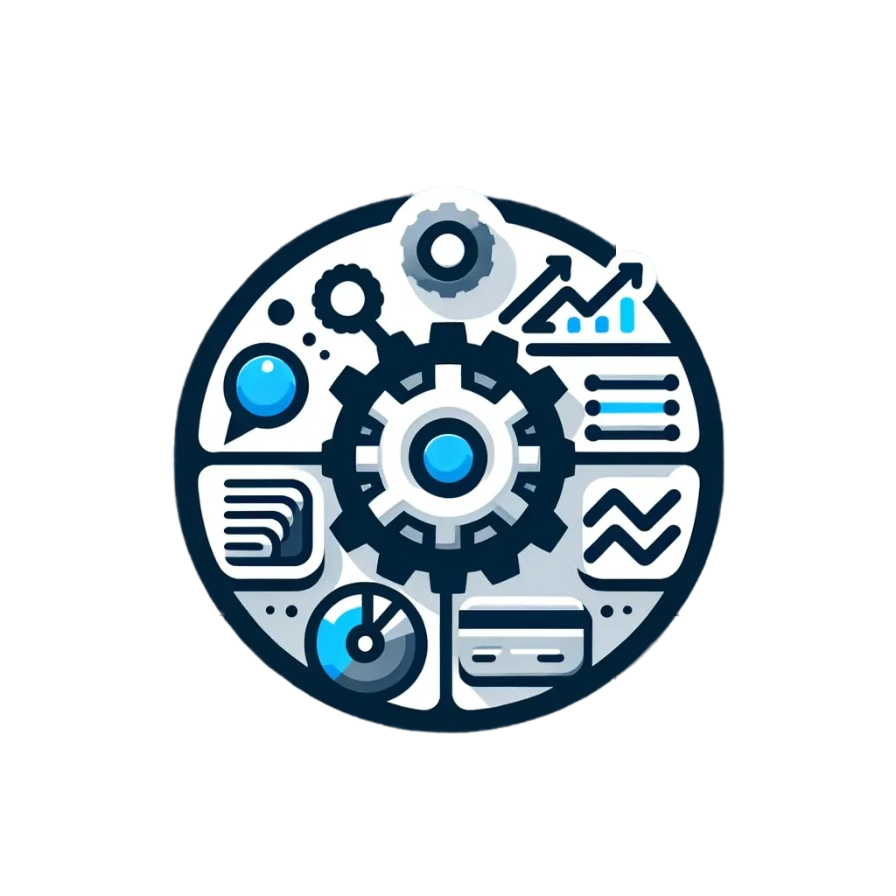
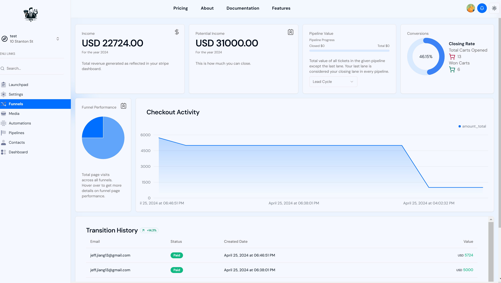

<div align="center" id="top" className="mb-10">


&#xa0;

  

<a href="https://jj-tailortech.vercel.app/">Demo</a>

</div>

# SaaS Website Builder, Project Management, and Dashboard with Stripe

TailorTech is a SaaS platform leverages the latest technologies including Next.js 14, Bun, Stripe Connect, Prisma, MySQL, and Tailwind to offer a robust solution for building websites, managing projects, and handling financial transactions seamlessly. Designed for agencies, freelancers, and businesses, our platform simplifies the digital landscape through an intuitive interface and powerful features.

## Features

- **Multivendor B2B2B SaaS**: Cater to a broad range of businesses with multi-vendor support.
- **Agency and Sub Accounts**: Manage multiple client accounts under a single agency dashboard.
- **Unlimited Funnel Hosting**: Launch and host as many marketing funnels as you need.
- **Full Website & Funnel Builder**: Create stunning websites and funnels with ease.
- **Role-based Access Control**: Assign roles and permissions for team collaboration.
- **Stripe Subscription Plans**: Offer customizable subscription services.
- **Stripe Add-on Products**: Extend your service offerings with add-on products.
- **Stripe Connect Integration**: Facilitate secure and seamless financial transactions.
- **Custom Dashboards**: Track performance, sales, and more with tailored dashboards.
- **Media Storage**: Store and manage digital assets efficiently.
- **Stripe Product Sync**: Keep your Stripe products in sync with your platform.
- **Custom Checkouts on Funnels**: Optimize conversion with customizable checkout experiences.
- **Lead Generation from Funnels**: Capture and manage leads directly from your funnels.
- **Kanban Board**: Organize tasks and projects with a visual Kanban board.
- **Project Management System**: Manage your projects with comprehensive tools.
- **Notifications**: Stay updated with real-time alerts and notifications.
- **Funnel Performance Metrics**: Analyze funnel performance to optimize strategies.
- **Agency and Subaccount Metrics**: Gain insights into your agency's overall performance.
- **Graphs and Charts**: Visualize data with dynamic graphs and charts.
- **Light & Dark Mode**: Enhance user experience with theme options.
- **Functioning Landing Page**: Get started quickly with a ready-to-use landing page.

## Getting Started

1. **Prerequisites**: Ensure you have Node.js, Bun, and MySQL installed on your machine.
2. **Installation**:
    ```sh
    bun install
    ```
3. **Configuration**: Set up your `.env` file with your Stripe API keys and database credentials.
4. **Running the Application**:
    ```sh
    bun run dev
    ```
    This will start the application in development mode on `http://localhost:3000`.

## Documentation

For detailed documentation on setup, features, and usage, visit [our documentation](#).

## Support and Community

Join our community for support, to report bugs, or to collaborate on future enhancements. Connect with us on Discord or follow us on Instagram.

## Contributing

We welcome contributions! Please read our [contributing guidelines](CONTRIBUTING.md) before submitting pull requests.

## License

This project is available for non-commercial use. Please contact me at Linkedin to discuss licensing for commercial purposes.

---

© 2024 Jeff Jiang. All rights reserved.
